# mud-server-java

Portage Java/Spring Boot d'un serveur MUD telnet (initialement en PHP/Swoole), avec des
règles de jeu inspirées de DnD5e : combat au tour par tour, personnages avec caractéristiques,
classes et compétences maîtrisées, déplacement sur grille hexagonale, objets/équipement,
monstres avec butin et zones d'agressivité, PNJ marchands.

## Démo



Deux joueurs connectés simultanément (Aldric et Elowen, chacun dans son panneau tmux),
déplacement sur la grille hexagonale, achat auprès d'un PNJ marchand, discussion entre les
deux via `say`, combat déclenché automatiquement à l'approche d'un monstre puis rejoint par
le second joueur en cours de route, et butin récupéré à sa mort — deux vraies sessions
telnet enregistrées côte à côte contre le serveur (voir [`docs/demo/`](docs/demo/) pour
régénérer cette démo).

## Commandes

Une commande par ligne, groupées par état de connexion — voir `network/ConnectionState`
(`CONNECTED`, `CHARSELECT`, `INGAME`) et les classes `CommandHandler` sous
`network/command/{connected,charselect,ingame}`.

**Non connecté** (`CONNECTED`)

| Commande | Effet |
| --- | --- |
| `register` | Créer un compte |
| `login` | Se connecter à un compte existant |
| `quit` | Fermer la connexion |

**Sélection de personnage** (`CHARSELECT`, juste après le login ; la liste des personnages
du compte, s'il y en a, est affichée automatiquement en entrant)

| Commande | Effet |
| --- | --- |
| `character-list` | Lister les personnages du compte |
| `character-create` | Créer un personnage (nom, genre, race, classe) |
| `character-select` | Incarner un personnage existant (`character-select <name>`) |
| `character-delete` | Supprimer un personnage (`character-delete <name>`) |

**En jeu** (`INGAME`)

| Commande | Effet |
| --- | --- |
| `look` | Décrire la room et la grille hexagonale courantes |
| `examine` | Examiner un objet, un PNJ ou un monstre (`examine <name>`) |
| `go` | Se déplacer de 1 à N cases dans une direction (`go <direction> [nombre]`) |
| `stop` | Interrompre un déplacement en cours |
| `portal` | Emprunter le portail présent sur la case courante |
| `say` | Parler aux autres joueurs de la room |
| `talk` | Engager le dialogue avec un PNJ (peut ouvrir sa boutique) (`talk <npc>`) |
| `drop` | Détruire définitivement un objet de l'inventaire (`drop <name>`) |
| `equip` / `unequip` | Équiper / retirer un objet (`equip <name>` / `unequip <name>`) |
| `inventory` | Lister son inventaire et son équipement |
| `use` | Utiliser un objet consommable (`use <item name>`) |
| `stats` | Afficher sa fiche de personnage |
| `roll` | Lancer un dé |
| `check` | Faire un jet de compétence ou de sauvegarde contre une difficulté |
| `select` | Choisir sa cible de combat (`select <monster name>`) |
| `attack` | Attaquer sa cible sélectionnée |
| `rest` | Repos court ou long, hors combat (`rest <short|long>`) |
| `save` | Sauvegarder l'état du personnage |

**Dans tout état authentifié** (`CHARSELECT`/`INGAME`)

| Commande | Effet |
| --- | --- |
| `logout` | Se déconnecter et revenir à l'écran de connexion |

**Dans tout état** (y compris avant login)

| Commande | Effet |
| --- | --- |
| `help` | Lister les commandes disponibles dans l'état courant |

## Protocole TUI (JSON)

En parallèle du telnet (port 4001, texte brut), le serveur expose un transport JSON sur
socket TCP brute, port **4002**, destiné à un futur client TUI. Une ligne = un message JSON,
terminé par `\n`.

**Entrée (client → serveur)** — une commande :

```json
{"verb": "look", "argument": ""}
{"verb": "go", "argument": "nord 2"}
```

`verb` est traité insensible à la casse. Quand le serveur attend une réponse ponctuelle
(ex. confirmation), la ligne suivante est interprétée comme une réponse et non comme une
commande :

```json
{"reply": "yes"}
```

**Sortie (serveur → client)** — chaque message est enveloppé ainsi :

```json
{"type": "<NomDeLaClasse>", "payload": { ... }, "secure": false}
```

`type` est le nom simple de la classe Java du message (ex. `Chat`, `XpGained`,
`Inventory`) ; `secure` vaut `true` pour les messages sensibles (ex. mot de passe) à ne
pas logger/afficher en clair. La plupart des messages sérialisent directement leurs
champs comme `payload` :

```json
{"type": "XpGained", "payload": {"amount": 50}, "secure": false}
{"type": "Chat", "payload": {"speakerLogin": "aldric", "text": "salut"}, "secure": false}
```

Trois messages construisent un `payload` dédié plutôt que de sérialiser l'objet
domaine brut :

- `ViewAround` — la room et sa grille hexagonale : `roomName`, `roomDescription`,
  `cells` (liste de `{q, r, kind}`, `kind` ∈ `self/floor/path/destination/portal/
  portalDestination/player/monster/npc/outOfBounds`), `portals`
  (`{direction, targetRoomName}`), `charactersNearby`, `monstersNearby`, `npcsNearby`.
- `GamePlayerStats` — fiche de personnage : `name`, `gender`, `level`,
  `characterClass`, `currentHealth`, `maxHealth`, `armorClass`, `proficiencyBonus`,
  les six caractéristiques (`strength`, `dexterity`, ... en `{score, modifier}`),
  `primaryAbility`, `savingThrowProficiencies`, `skillProficiencies`.
- `MonsterStatBlock` — fiche de monstre : `name`, `description`, `currentHealth`,
  `maxHealth`, `armorClass`, les six caractéristiques en `{score, modifier}`.

En cas d'erreur de parsing ou d'exécution, le serveur répond avec `{"type": "Error",
"payload": {"message": "..."}, "secure": false}` sans fermer la connexion.

## Stack

- **Java 25**, **Spring Boot 4.1**
- **jOOQ** pour la persistance — un DSL SQL type-safe, pas un ORM : pas de contexte de
  persistance, pas de lazy loading, pas de dirty-checking
- **Flyway** comme source de vérité du schéma ; les classes jOOQ sont générées à la
  compilation directement depuis les migrations Flyway (aucune connexion DB requise pour la
  génération)
- **Netty** pour le serveur telnet, avec un **virtual thread par connexion** (JDK 25) plutôt
  qu'un pool de threads partagé
- **SQLite** — fichier unique local, aucun serveur de base de données à faire tourner

## Lancer le projet

Ni Java ni Maven ne sont nécessaires sur la machine hôte : tout passe par Docker (uniquement
pour faire tourner Maven — la base SQLite est un simple fichier local, rien à démarrer).

```bash
# Build
docker run --rm -v "$(pwd)":/app -w /app -v ~/.m2:/root/.m2 \
  maven:3.9.16-eclipse-temurin-25 mvn package

# Tests
docker run --rm -v "$(pwd)":/app -w /app -v ~/.m2:/root/.m2 \
  maven:3.9.16-eclipse-temurin-25 mvn test

# Lancer le serveur (crée/ouvre ./mud-server.db à la racine du projet)
docker run --rm -v "$(pwd)":/app -w /app -v ~/.m2:/root/.m2 \
  maven:3.9.16-eclipse-temurin-25 mvn spring-boot:run
```

Le serveur telnet écoute sur le port **4001**, le transport JSON (voir ci-dessous) sur le
port **4002**.

```bash
telnet localhost 4001
```

## Pour aller plus loin

Conventions du projet, architecture de concurrence (virtual threads, verrouillage), et
détails par sous-système : voir [`CLAUDE.md`](CLAUDE.md).
